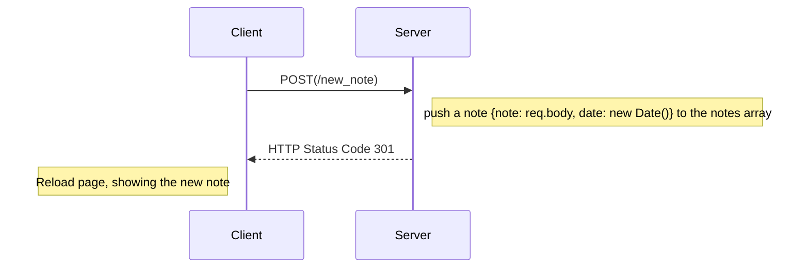

```mermaid
sequenceDiagram
Client->>Server: POST(/new_note)
Note right of Server: push a note {note: req.body, date: new Date()} to the notes array
Server-->>Client: HTTP Status Code 301
Note left of Client: Reload page, showing the new note 
```
