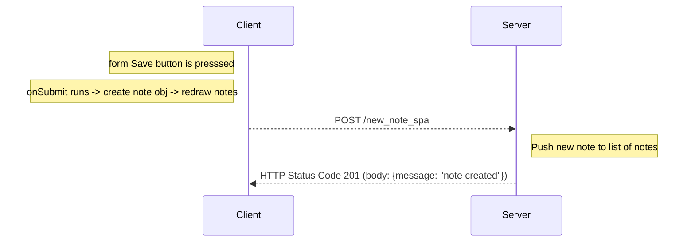

```mermaid
sequenceDiagram
Note left of Client: form Save button is presssed
Note left of Client: onSubmit runs -> create note obj -> redraw notes
Client-->>Server: POST /new_note_spa 
Note right of Server: Push new note to list of notes
Server-->>Client: HTTP Status Code 201 (body: {message: "note created"})
```
